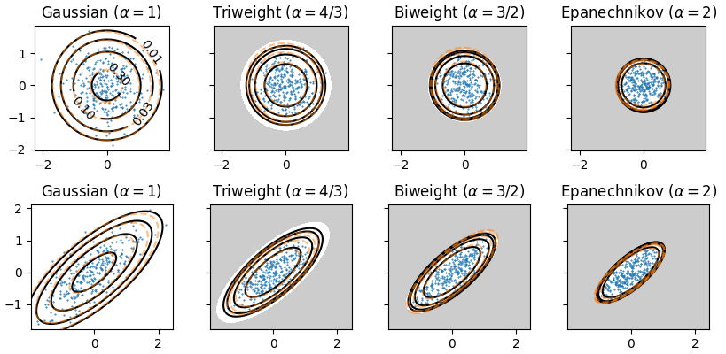

# spcdist: sparse continuous distributions in Python



This repository implements the beta-Gaussian 1-d and n-d distributions,
as well as continuous attention mechanisms based on it.

This is the companion code of the paper

> Sparse Continuous Distributions and Fenchel-Young Losses
> André F. T. Martins, Marcos Treviso, António Farinhas, Pedro M. Q. Aguiar, Mário A. T. Figueiredo, Mathieu Blondel, Vlad Niculae
> [preprint link](https://arxiv.org/abs/2108.01988)

which builds upon

> Sparse and Continuous Attention Mechanisms
> André Martins, António Farinhas, Marcos Treviso, Vlad Niculae, Pedro Aguiar, Mario Figueiredo
> NeurIPS 2020
> [link](https://papers.neurips.cc/paper/2020/hash/f0b76267fbe12b936bd65e203dc675c1-Abstract.html)

## Requirements:

numpy, scipy, (optional: pytorch>=1.8.1)

(Note: pytorch is optional, the `spcdist.{scipy, scipy_1d}` modules work without it.)

## Installation:

```bash
pip install .
# or
pip install .[torch]  # to also install the pytorch dependency 
```
